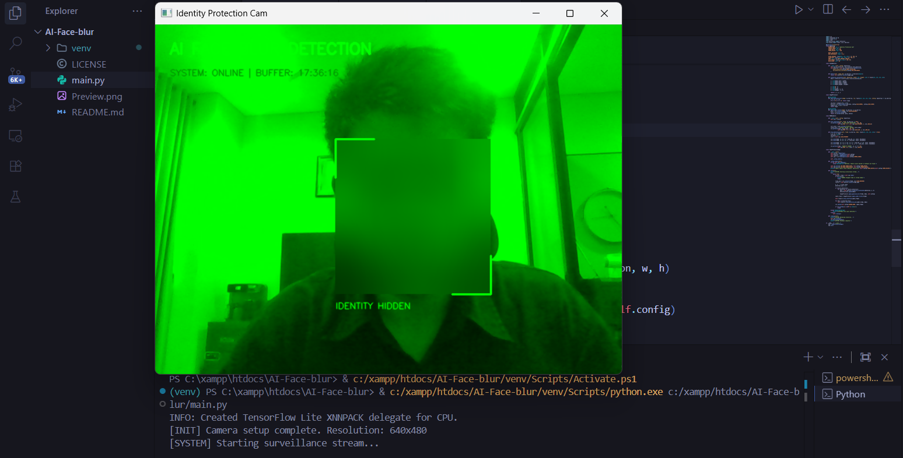

# FaceBlur Identity Protection Cam

 

## Deskripsi

**FaceBlur Identity Protection Cam** adalah sebuah aplikasi berbasis Python yang secara otomatis mendeteksi dan mengaburkan (blur) wajah dalam video stream secara *real-time*.

Proyek ini menggunakan **MediaPipe** dari Google untuk deteksi wajah yang akurat dan ringan, serta **OpenCV** untuk pemrosesan citra.

## Mengapa Proteksi Identitas Wajah Penting di Era AI?

Di era Industri 4.0 dan AI, data biometrik seperti wajah menjadi salah satu aset paling berharga sekaligus rentan. Beberapa alasan mengapa mengaburkan wajah menjadi krusial adalah:

1.  **Mencegah Pelacakan Tanpa Izin:** Dengan semakin banyaknya kamera CCTV, drone, dan analisis video otomatis, wajah dapat digunakan untuk melacak pergerakan individu tanpa persetujuan mereka, mengancam privasi dan kebebasan sipil.

2.  **Melindungi dari Penyalahgunaan Model AI:** Model *facial recognition* dapat disalahgunakan untuk tujuan diskriminatif, seperti dalam proses rekrutmen, penegakan hukum yang bias, atau pengawasan massal oleh pemerintah otoriter. Mengaburkan wajah pada dataset atau video publik dapat mencegah data tersebut digunakan untuk melatih model yang berbahaya.

3.  **Ancaman Deepfake dan Pencurian Identitas:** Wajah seseorang dapat diekstraksi dari video atau foto untuk membuat *deepfake*, menyebarkan disinformasi, atau melakukan penipuan. Dengan mengaburkan wajah sumber, risiko eksploitasi ini dapat diminimalisir.

Singkatnya, alat blur wajah otomatis adalah garda depan pertahanan dalam menjaga anonimitas dan melindungi hak fundamental atas privasi di dunia yang semakin terhubung dan terotomatisasi.

---

## Fitur Utama

-   **Deteksi Wajah Real-Time:** Menggunakan model ML BlazeFace dari MediaPipe yang cepat dan akurat.
-   **Blur Otomatis:** Setiap wajah yang terdeteksi akan langsung diberikan efek *Gaussian Blur* untuk menyembunyikan identitas.
-   **Konfigurasi Terpusat:** Semua parameter (warna, resolusi, model) dapat diubah dengan mudah melalui `AppConfig`.

## Prasyarat

-   **Python 3.10**: Proyek ini diuji dan paling stabil berjalan pada **Python 3.10.x**. Versi Python yang lebih baru (3.11+) mungkin mengalami masalah kompatibilitas dengan versi `protobuf` yang dibutuhkan `mediapipe`.
-   Webcam yang terhubung ke komputer.
-   `pip` dan `venv` (termasuk dalam instalasi Python standar).

## Panduan Instalasi

1.  **Clone Repositori (Jika di-host di Git)**
    ```bash
    git clone https://github.com/username/face_blur_project.git
    cd face_blur_project
    ```
    Atau cukup buat folder proyek secara manual.

2.  **Buat dan Aktifkan Virtual Environment (venv)**

    *   Pastikan Anda menggunakan Python 3.10 untuk membuat venv:
        ```bash
        # Untuk Windows
        py -3.10 -m venv venv
        
        # Untuk macOS/Linux
        python3.10 -m venv venv
        ```

    *   Aktifkan venv:
        ```bash
        # Windows
        .\venv\Scripts\activate
        
        # macOS/Linux
        source venv/bin/activate
        ```

3.  **Install Library yang Dibutuhkan**

    Jalankan perintah berikut untuk menginstall versi library yang sudah teruji kompatibel:
    ```bash
    pip install --upgrade pip
    pip install mediapipe==0.10.9 protobuf==3.20.3 opencv-python numpy
    ```
    *Catatan: Menggunakan versi spesifik ini sangat penting untuk menghindari error `TypeError: descriptors cannot not be created directly`.*

## Cara Menjalankan

Setelah semua library terinstall, jalankan script utama dari terminal:

```bash
python main.py